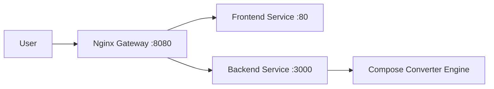

# Architecture Notes

## Runtime Architecture (Docker Compose)

## Request Flow
1. User submits Compose YAML in frontend.
2. Frontend calls `POST /api/convert` through gateway.
3. Backend parses YAML, generates manifests, warnings, and job ID.
4. Frontend displays manifests and allows ZIP download.

## Observability Flow
- Gateway routes `/api/metrics` to backend.
- Prometheus scrapes gateway endpoint for metrics.
