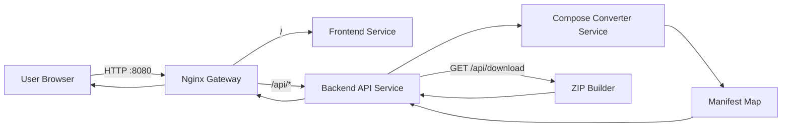
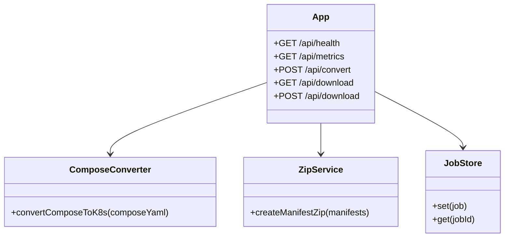

# Design Document

## 1. Architecture Overview

## 2. High-Level Components
- Docker Compose Runtime:
  - `gateway` service (Nginx) exposes port `8080`
  - `frontend` service hosts static React build
  - `backend` service runs Express API on port `3000`
- Frontend (`src/main/frontend`):
  - MUI-based interface
  - Monaco editor for YAML input
  - Services summary, warnings, manifest tabs, ZIP download
- Backend (`src/main/backend`):
  - Express API
  - Compose parsing with `js-yaml`
  - Conversion logic for Deployment/Service/ConfigMap/Secret/PVC
  - ZIP creation with `archiver`
  - Metrics endpoint with `prom-client`

## 3. Backend Module Design

## 4. Conversion Rules
- `services.<name>` -> `Deployment` with label `app: <name>`
- `ports` -> container ports; host ports are ignored with warning
- `environment`:
  - keys containing `PASS`, `SECRET`, `TOKEN`, `KEY` -> `Secret`
  - all others -> `ConfigMap`
- `volumes`:
  - named volume -> `PVC` + `volumeMount`
  - bind/anonymous -> `emptyDir` + warning
- `depends_on` -> warning (not strict startup ordering in Kubernetes)
- `networks` -> ignored with warning
- `build` without `image` -> placeholder image `local/<service>:latest` + warning

## 5. Validation and Error Handling
- Empty input -> HTTP 400
- YAML parse failure -> HTTP 400
- Missing `services` section -> HTTP 400
- Unsupported fields -> warning list, not hard failure

## 6. Observability
- `/api/health` for health checks
- `/api/metrics` exposing Prometheus metrics
- JSON logs via `pino` / `pino-http`
- Log retention policy: 30 days (documented operational policy)

## 7. Known Limitations
- Advanced Compose networking is not mapped
- Complex volume drivers are mapped best-effort
- Healthcheck fields are not fully converted into Kubernetes probes
- Kubernetes manifests assume images are available as `converter-backend:latest` and `converter-frontend:latest`
